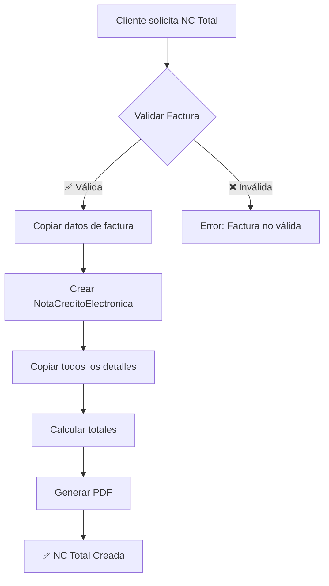
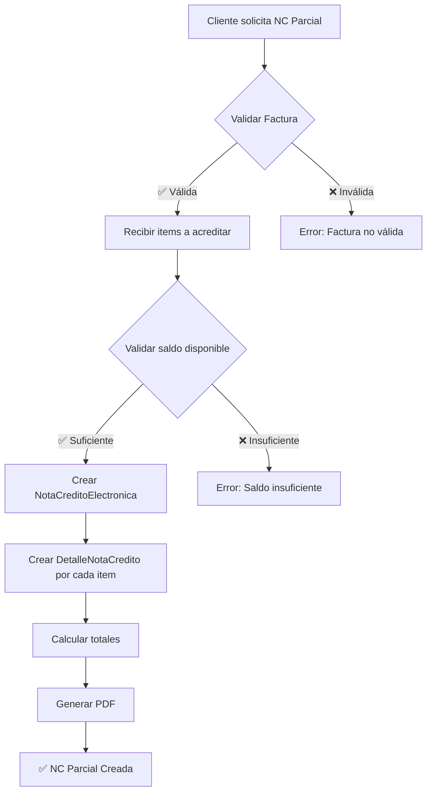

# 📄 Notas de Crédito Electrónicas - GroupTours

## 📋 Índice

1. [Descripción General](#descripción-general)
2. [Conceptos Clave](#conceptos-clave)
3. [Modelos de Datos](#modelos-de-datos)
4. [Flujos de Negocio](#flujos-de-negocio)
5. [API Reference](#api-reference)
6. [Ejemplos de Uso](#ejemplos-de-uso)
7. [Validaciones y Reglas de Negocio](#validaciones-y-reglas-de-negocio)
8. [Integración con Frontend](#integración-con-frontend)
9. [Administración Django](#administración-django)
10. [Troubleshooting](#troubleshooting)

---

## 📖 Descripción General

El sistema de **Notas de Crédito Electrónicas** permite anular total o parcialmente facturas emitidas en GroupTours, siguiendo las normativas de la SET (Subsecretaría de Estado de Tributación) de Paraguay.

### ¿Qué es una Nota de Crédito?

Una **Nota de Crédito** es un documento tributario que:
- ❌ **Anula** total o parcialmente una factura previamente emitida
- 💰 **Acredita** (resta) el monto de la factura original
- 📄 **Mantiene** la trazabilidad de la operación
- ✅ **Cumple** con las normativas tributarias paraguayas

### Casos de Uso

1. ✈️ **Cancelación de Reserva** - Cliente cancela el viaje completo
2. 👥 **Reducción de Pasajeros** - Algunos pasajeros cancelan su participación
3. 🎁 **Descuentos Posteriores** - Se aplica un descuento después de facturar
4. ❗ **Error en Facturación** - Corrección de datos erróneos (precio, IVA, etc.)
5. 🔄 **Cambio de Cliente** - Emisión a nombre equivocado

---

## 🔑 Conceptos Clave

### Tipos de Nota de Crédito

| Tipo | Descripción | Uso |
|------|-------------|-----|
| **Total** | Anula el 100% del saldo de la factura | Cancelaciones completas |
| **Parcial** | Anula un monto específico o items seleccionados | Cancelaciones parciales, ajustes |

### Estados de Factura

Después de emitir NC, una factura puede estar en uno de estos estados:

```
✅ Activa (sin NC)
   └─ total_general: Gs. 10.000.000
   └─ total_acreditado: Gs. 0
   └─ saldo_neto: Gs. 10.000.000

⚠️  Parcialmente Acreditada (con NC parciales)
   └─ total_general: Gs. 10.000.000
   └─ total_acreditado: Gs. 3.000.000
   └─ saldo_neto: Gs. 7.000.000

🚫 Totalmente Anulada (con NC total)
   └─ total_general: Gs. 10.000.000
   └─ total_acreditado: Gs. 10.000.000
   └─ saldo_neto: Gs. 0
```

### Motivos de Emisión

El sistema soporta los siguientes motivos:

- `cancelacion_reserva` - Cancelación de Reserva
- `devolucion` - Devolución
- `descuento` - Descuento/Bonificación
- `error_facturacion` - Error en Facturación
- `ajuste` - Ajuste de Precio
- `otro` - Otro

---

## 🗄️ Modelos de Datos

### NotaCreditoElectronica

**Tabla:** `nota_credito_electronica`

| Campo | Tipo | Descripción |
|-------|------|-------------|
| `id` | Integer | ID único de la nota de crédito |
| `numero_nota_credito` | CharField(15) | Número correlativo (XXX-XXX-XXXXXXX) |
| `factura_afectada` | ForeignKey | Factura que se está anulando (PROTECT) |
| `tipo_nota` | CharField(20) | 'total' o 'parcial' |
| `motivo` | CharField(50) | Motivo de emisión (choices) |
| `observaciones` | TextField | Observaciones adicionales (opcional) |
| `fecha_emision` | DateTimeField | Fecha y hora de emisión (auto) |
| `empresa` | ForeignKey | Empresa emisora |
| `establecimiento` | ForeignKey | Establecimiento |
| `punto_expedicion` | ForeignKey | Punto de expedición |
| `timbrado` | ForeignKey | Timbrado vigente |
| `cliente_*` | Varios | Datos del cliente (copiados de factura) |
| `tipo_impuesto` | ForeignKey | Tipo de impuesto (IVA) |
| `subtipo_impuesto` | ForeignKey | Subtipo (10%, 5%, Exento) |
| `moneda` | ForeignKey | Moneda de la operación |
| `total_exenta` | Decimal(15,2) | Total exento acreditado |
| `total_gravada_5` | Decimal(15,2) | Total IVA 5% acreditado |
| `total_gravada_10` | Decimal(15,2) | Total IVA 10% acreditado |
| `total_iva_5` | Decimal(15,2) | IVA 5% acreditado |
| `total_iva_10` | Decimal(15,2) | IVA 10% acreditado |
| `total_iva` | Decimal(15,2) | Total IVA acreditado |
| `total_general` | Decimal(15,2) | Total acreditado |
| `pdf_generado` | FileField | PDF de la nota de crédito |
| `activo` | Boolean | Si está activa |

**Métodos:**

- `generar_numero_nota_credito()` - Genera número correlativo
- `calcular_totales()` - Calcula totales sumando detalles
- `generar_pdf()` - Genera PDF con formato SET

**Propiedades:**

- `saldo_factura_restante` - Saldo que queda de la factura afectada

### DetalleNotaCredito

**Tabla:** `detalle_nota_credito`

| Campo | Tipo | Descripción |
|-------|------|-------------|
| `id` | Integer | ID único del detalle |
| `nota_credito` | ForeignKey | Nota de crédito (CASCADE) |
| `numero_item` | PositiveInteger | Número de línea |
| `descripcion` | CharField(250) | Descripción del item |
| `cantidad` | Decimal(10,2) | Cantidad a acreditar |
| `precio_unitario` | Decimal(15,2) | Precio unitario |
| `monto_exenta` | Decimal(15,2) | Monto exento |
| `monto_gravada_5` | Decimal(15,2) | Monto IVA 5% |
| `monto_gravada_10` | Decimal(15,2) | Monto IVA 10% |
| `subtotal` | Decimal(15,2) | Subtotal (auto-calculado) |
| `detalle_factura_afectado` | ForeignKey | Detalle de factura (opcional) |

**Restricciones:**

- `unique_together`: (`nota_credito`, `numero_item`)

### Extensiones en FacturaElectronica

Se agregaron las siguientes **propiedades calculadas**:

```python
@property
def total_acreditado(self):
    """Suma de todas las NC activas"""
    return Decimal('...')

@property
def saldo_neto(self):
    """total_general - total_acreditado"""
    return Decimal('...')

@property
def esta_totalmente_acreditada(self):
    """saldo_neto == 0"""
    return bool

@property
def esta_parcialmente_acreditada(self):
    """Tiene NC pero saldo_neto > 0"""
    return bool

def puede_generar_nota_credito(self):
    """Valida si se puede generar NC"""
    return (bool, str)
```

---

## 🔄 Flujos de Negocio

### 1. Generar Nota de Crédito Total



**Código:**

```python
from apps.facturacion.models import generar_nota_credito_total

nota_credito = generar_nota_credito_total(
    factura_id=123,
    motivo='cancelacion_reserva',
    observaciones='Cliente canceló el viaje'
)
```

### 2. Generar Nota de Crédito Parcial



**Código:**

```python
from apps.facturacion.models import generar_nota_credito_parcial

nota_credito = generar_nota_credito_parcial(
    factura_id=123,
    items_a_acreditar=[
        {
            'descripcion': 'Paquete Tour a Iguazú',
            'cantidad': 2,
            'precio_unitario': 2500000
        }
    ],
    motivo='reduccion_pasajeros',
    observaciones='2 pasajeros cancelaron'
)
```

---

## 🌐 API Reference

### Base URL

```
/api/facturacion/
```

### Autenticación

Todos los endpoints requieren autenticación JWT:

```http
Authorization: Bearer <token>
```

---

### 1. Generar Nota de Crédito Total

**Endpoint:**

```http
POST /api/facturacion/generar-nota-credito-total/{factura_id}/
```

**Request Body:**

```json
{
  "motivo": "cancelacion_reserva",
  "observaciones": "Cliente canceló el viaje por motivos personales"
}
```

**Response (201 Created):**

```json
{
  "message": "Nota de crédito total generada exitosamente",
  "nota_credito": {
    "id": 456,
    "numero_nota_credito": "001-001-0000078",
    "factura_afectada": 123,
    "factura_numero": "001-001-0000456",
    "tipo_nota": "total",
    "tipo_nota_display": "Anulación Total",
    "motivo": "cancelacion_reserva",
    "motivo_display": "Cancelación de Reserva",
    "observaciones": "Cliente canceló el viaje por motivos personales",
    "fecha_emision": "2025-11-06T16:45:00Z",
    "cliente_nombre": "Juan Pérez",
    "cliente_numero_documento": "12345678",
    "total_general": "12000000.00",
    "saldo_factura_restante": "0.00",
    "moneda_codigo": "PYG",
    "pdf_generado": "/media/facturas/notas_credito/pdf/nota_credito_001_001_0000078.pdf",
    "detalles": [
      {
        "numero_item": 1,
        "descripcion": "Paquete Tour a Iguazú",
        "cantidad": "4.00",
        "precio_unitario": "2500000.00",
        "subtotal": "10000000.00",
        "monto_gravada_10": "10000000.00"
      },
      {
        "numero_item": 2,
        "descripcion": "Servicio Transfer",
        "cantidad": "1.00",
        "precio_unitario": "500000.00",
        "subtotal": "500000.00",
        "monto_gravada_10": "500000.00"
      }
    ],
    "factura_afectada_detalle": {
      "id": 123,
      "numero_factura": "001-001-0000456",
      "total_general": "12000000.00",
      "total_acreditado": "12000000.00",
      "saldo_neto": "0.00",
      "fecha_emision": "2025-10-15T14:30:00Z"
    }
  }
}
```

**Errores:**

| Código | Error | Descripción |
|--------|-------|-------------|
| 400 | El motivo es obligatorio | No se proporcionó el motivo |
| 400 | Factura inactiva | La factura no está activa |
| 400 | Factura ya totalmente acreditada | Ya se generó NC total |
| 404 | Not Found | Factura no existe |
| 500 | Error al generar nota de crédito | Error interno |

---

### 2. Generar Nota de Crédito Parcial

**Endpoint:**

```http
POST /api/facturacion/generar-nota-credito-parcial/{factura_id}/
```

**Request Body:**

```json
{
  "motivo": "reduccion_pasajeros",
  "observaciones": "2 pasajeros cancelaron su participación",
  "items": [
    {
      "descripcion": "Paquete Tour a Iguazú",
      "cantidad": 2,
      "precio_unitario": 2500000,
      "detalle_factura_id": 789
    },
    {
      "descripcion": "Servicio Transfer",
      "cantidad": 1,
      "precio_unitario": 500000
    }
  ]
}
```

**Campos de Items:**

| Campo | Tipo | Requerido | Descripción |
|-------|------|-----------|-------------|
| `descripcion` | String | ✅ | Descripción del item |
| `cantidad` | Number | ✅ | Cantidad a acreditar |
| `precio_unitario` | Number | ✅ | Precio unitario |
| `detalle_factura_id` | Integer | ❌ | ID del detalle de factura (opcional) |

**Response (201 Created):**

```json
{
  "message": "Nota de crédito parcial generada exitosamente",
  "nota_credito": {
    "id": 457,
    "numero_nota_credito": "001-001-0000079",
    "tipo_nota": "parcial",
    "total_general": "5500000.00",
    "saldo_factura_restante": "6500000.00",
    "detalles": [...]
  }
}
```

**Errores:**

| Código | Error | Descripción |
|--------|-------|-------------|
| 400 | El motivo es obligatorio | Falta el motivo |
| 400 | Debe especificar al menos un item | Array items vacío |
| 400 | Cada item debe tener: descripcion, cantidad y precio_unitario | Estructura incorrecta |
| 400 | El monto a acreditar (...) supera el saldo disponible (...) | Monto excede saldo |

---

### 3. Listar Notas de Crédito

**Endpoint:**

```http
GET /api/facturacion/notas-credito/
```

**Query Parameters:**

| Parámetro | Tipo | Descripción |
|-----------|------|-------------|
| `factura_id` | Integer | Filtra por factura afectada |
| `tipo_nota` | String | Filtra por tipo ('total' o 'parcial') |
| `motivo` | String | Filtra por motivo |

**Ejemplos:**

```http
GET /api/facturacion/notas-credito/
GET /api/facturacion/notas-credito/?factura_id=123
GET /api/facturacion/notas-credito/?tipo_nota=total
GET /api/facturacion/notas-credito/?motivo=cancelacion_reserva
```

**Response (200 OK):**

```json
{
  "notas_credito": [
    {
      "id": 456,
      "numero_nota_credito": "001-001-0000078",
      "factura_numero": "001-001-0000456",
      "tipo_nota_display": "Anulación Total",
      "motivo_display": "Cancelación de Reserva",
      "total_general": "12000000.00",
      "fecha_emision": "2025-11-06T16:45:00Z"
    }
  ],
  "total": 1
}
```

---

### 4. Detalle de Nota de Crédito

**Endpoint:**

```http
GET /api/facturacion/notas-credito/{nota_credito_id}/
```

**Response (200 OK):**

```json
{
  "id": 456,
  "numero_nota_credito": "001-001-0000078",
  "factura_afectada": 123,
  "tipo_nota": "total",
  "motivo": "cancelacion_reserva",
  "observaciones": "...",
  "total_general": "12000000.00",
  "detalles": [...],
  "factura_afectada_detalle": {...}
}
```

---

### 5. Notas de Crédito de una Factura

**Endpoint:**

```http
GET /api/facturacion/notas-credito-factura/{factura_id}/
```

**Response (200 OK):**

```json
{
  "factura": {
    "id": 123,
    "numero_factura": "001-001-0000456",
    "total_general": "12000000.00",
    "total_acreditado": "5500000.00",
    "saldo_neto": "6500000.00",
    "esta_totalmente_acreditada": false,
    "esta_parcialmente_acreditada": true
  },
  "notas_credito": [
    {
      "id": 456,
      "numero_nota_credito": "001-001-0000078",
      "tipo_nota": "parcial",
      "total_general": "5500000.00",
      "fecha_emision": "2025-11-06T16:45:00Z"
    }
  ],
  "total_nc": 1
}
```

---

### 6. Descargar PDF de Nota de Crédito

**Endpoint:**

```http
GET /api/facturacion/descargar-pdf-nota-credito/{nota_credito_id}/
```

**Query Parameters:**

| Parámetro | Tipo | Descripción |
|-----------|------|-------------|
| `regenerar` | Boolean | Fuerza regeneración del PDF (default: false) |

**Ejemplos:**

```http
GET /api/facturacion/descargar-pdf-nota-credito/456/
GET /api/facturacion/descargar-pdf-nota-credito/456/?regenerar=true
```

**Response (200 OK):**

Retorna el archivo PDF con headers:

```http
Content-Type: application/pdf
Content-Disposition: attachment; filename="nota_credito_001_001_0000078.pdf"
```

---

## 💡 Ejemplos de Uso

### Ejemplo 1: Cancelación Total de Reserva

**Escenario:** Cliente cancela completamente su reserva. Ya tiene una factura global emitida.

```javascript
// Frontend - JavaScript/React
const cancelarReservaConNC = async (facturaId) => {
  try {
    const response = await fetch(
      `/api/facturacion/generar-nota-credito-total/${facturaId}/`,
      {
        method: 'POST',
        headers: {
          'Content-Type': 'application/json',
          'Authorization': `Bearer ${token}`
        },
        body: JSON.stringify({
          motivo: 'cancelacion_reserva',
          observaciones: 'Cliente canceló el viaje por motivos personales. Se procederá con el reembolso según política de cancelación.'
        })
      }
    );

    const data = await response.json();

    if (response.ok) {
      console.log('✅ NC generada:', data.nota_credito.numero_nota_credito);

      // Descargar PDF automáticamente
      window.open(
        `/api/facturacion/descargar-pdf-nota-credito/${data.nota_credito.id}/`,
        '_blank'
      );

      return data.nota_credito;
    } else {
      console.error('❌ Error:', data.error);
      throw new Error(data.error);
    }
  } catch (error) {
    console.error('Error al generar NC:', error);
    throw error;
  }
};

// Uso
cancelarReservaConNC(123)
  .then(nc => alert(`NC ${nc.numero_nota_credito} generada`))
  .catch(err => alert(err.message));
```

---

### Ejemplo 2: Reducción de Pasajeros (NC Parcial)

**Escenario:** De 4 pasajeros, 2 cancelan. Necesitamos acreditar solo esos 2.

```javascript
const reducirPasajeros = async (facturaId, cantidadACancelar) => {
  // Primero obtenemos los detalles de la factura
  const facturaResponse = await fetch(`/api/facturacion/facturas/${facturaId}/`);
  const factura = await facturaResponse.json();

  // Buscamos el item del paquete
  const itemPaquete = factura.detalles.find(d =>
    d.descripcion.includes('Paquete')
  );

  if (!itemPaquete) {
    throw new Error('No se encontró el paquete en la factura');
  }

  // Generar NC parcial
  const response = await fetch(
    `/api/facturacion/generar-nota-credito-parcial/${facturaId}/`,
    {
      method: 'POST',
      headers: {
        'Content-Type': 'application/json',
        'Authorization': `Bearer ${token}`
      },
      body: JSON.stringify({
        motivo: 'reduccion_pasajeros',
        observaciones: `${cantidadACancelar} pasajeros cancelaron su participación`,
        items: [
          {
            descripcion: itemPaquete.descripcion,
            cantidad: cantidadACancelar,
            precio_unitario: itemPaquete.precio_unitario,
            detalle_factura_id: itemPaquete.id
          }
        ]
      })
    }
  );

  const data = await response.json();

  if (response.ok) {
    console.log('✅ NC Parcial generada');
    console.log(`Monto acreditado: ${data.nota_credito.total_general}`);
    console.log(`Saldo restante: ${data.nota_credito.saldo_factura_restante}`);
    return data.nota_credito;
  } else {
    throw new Error(data.error);
  }
};

// Uso
reducirPasajeros(123, 2)
  .then(nc => console.log('NC generada:', nc))
  .catch(err => console.error(err));
```

---

### Ejemplo 3: Consultar Estado de Factura

```javascript
const consultarEstadoFactura = async (facturaId) => {
  const response = await fetch(
    `/api/facturacion/notas-credito-factura/${facturaId}/`,
    {
      headers: {
        'Authorization': `Bearer ${token}`
      }
    }
  );

  const data = await response.json();

  console.log('📄 Factura:', data.factura.numero_factura);
  console.log('💰 Total Original:', data.factura.total_general);
  console.log('❌ Total Acreditado:', data.factura.total_acreditado);
  console.log('✅ Saldo Neto:', data.factura.saldo_neto);
  console.log('📋 Notas de Crédito:', data.total_nc);

  if (data.factura.esta_totalmente_acreditada) {
    console.log('🚫 Factura TOTALMENTE ANULADA');
  } else if (data.factura.esta_parcialmente_acreditada) {
    console.log('⚠️  Factura PARCIALMENTE ACREDITADA');
  } else {
    console.log('✅ Factura ACTIVA (sin NC)');
  }

  return data;
};
```

---

### Ejemplo 4: Python/Django Shell

```python
# En Django shell
from apps.facturacion.models import (
    FacturaElectronica,
    generar_nota_credito_total,
    generar_nota_credito_parcial
)

# Obtener factura
factura = FacturaElectronica.objects.get(numero_factura='001-001-0000456')

# Verificar si se puede generar NC
puede, mensaje = factura.puede_generar_nota_credito()
print(f"¿Puede generar NC? {puede} - {mensaje}")

# Generar NC Total
nc_total = generar_nota_credito_total(
    factura_id=factura.id,
    motivo='cancelacion_reserva',
    observaciones='Cancelación solicitada por el cliente'
)
print(f"NC generada: {nc_total.numero_nota_credito}")

# Generar NC Parcial
nc_parcial = generar_nota_credito_parcial(
    factura_id=factura.id,
    items_a_acreditar=[
        {
            'descripcion': 'Paquete Tour',
            'cantidad': 2,
            'precio_unitario': 2500000
        }
    ],
    motivo='reduccion_pasajeros',
    observaciones='2 pasajeros cancelaron'
)
print(f"Monto acreditado: {nc_parcial.total_general}")

# Consultar estado
print(f"Saldo neto de factura: {factura.saldo_neto}")
print(f"¿Totalmente acreditada? {factura.esta_totalmente_acreditada}")
```

---

## ✅ Validaciones y Reglas de Negocio

### Validaciones Automáticas

| Validación | Descripción | Error |
|------------|-------------|-------|
| **Factura Activa** | La factura debe estar activa | "Factura inactiva" |
| **No Configuración** | No se puede acreditar facturas de configuración | "No se puede acreditar una factura de configuración" |
| **Saldo Disponible** | El monto a acreditar no puede exceder el saldo | "El monto a acreditar (...) supera el saldo disponible (...)" |
| **NC Total Única** | Si existe NC, no se puede generar NC total | "No se puede generar nota de crédito total si ya existen notas parciales" |
| **Monto Exacto NC Total** | NC total debe ser igual al saldo completo | "La nota de crédito total debe acreditar el saldo completo (...)" |
| **Items Requeridos** | NC parcial debe tener al menos un item | "Debe especificar al menos un item a acreditar" |
| **Estructura Items** | Cada item debe tener descripcion, cantidad, precio_unitario | "Cada item debe tener: descripcion, cantidad y precio_unitario" |

### Reglas de Negocio

#### 1. Numeración de NC

- ✅ Correlativo **INDEPENDIENTE** de facturas
- ✅ Formato: `XXX-XXX-XXXXXXX` (Establecimiento-PuntoExpedición-Correlativo)
- ✅ Ejemplo: `001-001-0000001`
- ✅ Auto-incrementa por punto de expedición

#### 2. Protección de Datos

- 🔒 Factura con NC activas **NO se puede eliminar** (PROTECT)
- 🔒 Datos del cliente se **copian** en la NC (trazabilidad)
- 🔒 Impuestos y moneda se **copian** de la factura original

#### 3. Cálculo de IVA

**Paraguay usa IVA INCLUIDO:**

```python
# Para IVA 10%
total_iva_10 = (monto_gravada_10 * 10) / 110

# Para IVA 5%
total_iva_5 = (monto_gravada_5 * 5) / 105
```

El IVA se **extrae** del monto, NO se suma.

#### 4. Estados de Factura

```python
# Una factura puede estar en:
if factura.saldo_neto == 0:
    estado = "Totalmente Anulada"
elif factura.total_acreditado > 0:
    estado = "Parcialmente Acreditada"
else:
    estado = "Activa"
```

#### 5. Generación de PDF

- ✅ Se genera automáticamente al crear NC
- ✅ Incluye referencia a factura afectada
- ✅ Muestra saldo restante de la factura
- ✅ Formato oficial SET Paraguay
- ✅ Se puede regenerar con `?regenerar=true`

---

## 🎨 Integración con Frontend

### Componente React: TabFacturas

```jsx
// TabFacturas.jsx
import React, { useState, useEffect } from 'react';

const TabFacturas = ({ reservaId }) => {
  const [facturas, setFacturas] = useState([]);
  const [modalNC, setModalNC] = useState(false);
  const [facturaSeleccionada, setFacturaSeleccionada] = useState(null);

  useEffect(() => {
    cargarFacturas();
  }, [reservaId]);

  const cargarFacturas = async () => {
    const response = await fetch(`/api/facturacion/facturas-reserva/${reservaId}/`);
    const data = await response.json();
    setFacturas(data.facturas);
  };

  const abrirModalNC = (factura) => {
    // Verificar si puede generar NC
    if (factura.esta_totalmente_acreditada) {
      alert('Esta factura ya está totalmente anulada');
      return;
    }

    setFacturaSeleccionada(factura);
    setModalNC(true);
  };

  const generarNC = async (tipo, datos) => {
    const endpoint = tipo === 'total'
      ? `/api/facturacion/generar-nota-credito-total/${facturaSeleccionada.id}/`
      : `/api/facturacion/generar-nota-credito-parcial/${facturaSeleccionada.id}/`;

    const response = await fetch(endpoint, {
      method: 'POST',
      headers: { 'Content-Type': 'application/json' },
      body: JSON.stringify(datos)
    });

    if (response.ok) {
      const data = await response.json();
      alert(`NC ${data.nota_credito.numero_nota_credito} generada`);
      cargarFacturas(); // Recargar para actualizar saldos
      setModalNC(false);
    } else {
      const error = await response.json();
      alert(`Error: ${error.error}`);
    }
  };

  return (
    <div className="tab-facturas">
      <h3>Facturas de esta Reserva</h3>

      {facturas.map(factura => (
        <div key={factura.id} className="factura-card">
          <h4>Factura {factura.numero_factura}</h4>
          <p>Monto: {factura.moneda_codigo} {factura.total_general}</p>
          {factura.esta_parcialmente_acreditada && (
            <div className="alert alert-warning">
              ⚠️ Parcialmente Acreditada
              <br/>Acreditado: {factura.total_acreditado}
              <br/>Saldo: {factura.saldo_neto}
            </div>
          )}
          {factura.esta_totalmente_acreditada && (
            <div className="alert alert-danger">
              🚫 Totalmente Anulada
            </div>
          )}

          <div className="acciones">
            <button onClick={() => descargarPDF(factura.id)}>
              📥 Ver PDF
            </button>
            {!factura.esta_totalmente_acreditada && (
              <button
                onClick={() => abrirModalNC(factura)}
                className="btn-danger"
              >
                🔴 Generar NC
              </button>
            )}
          </div>
        </div>
      ))}

      {modalNC && (
        <ModalNotaCredito
          factura={facturaSeleccionada}
          onGenerar={generarNC}
          onClose={() => setModalNC(false)}
        />
      )}
    </div>
  );
};

export default TabFacturas;
```

---

## 🔧 Administración Django

### Acceso al Admin

```
URL: /admin/facturacion/notacreditoelectronica/
```

### Funcionalidades Disponibles

1. ✅ **Listado de NC** con filtros por:
   - Tipo de nota
   - Motivo
   - Empresa
   - Establecimiento
   - Fecha de emisión

2. ✅ **Búsqueda** por:
   - Número de NC
   - Nombre del cliente
   - Número de documento
   - Observaciones

3. ✅ **Vista Detallada** con:
   - Información completa de la NC
   - Detalles inline (items)
   - Saldo factura restante
   - Metadata (fechas)

4. ✅ **Acciones**:
   - Activar/Desactivar NC
   - Ver detalles
   - Editar observaciones

### Permisos

Para gestionar NC desde admin, el usuario debe tener:

```python
# Permisos Django
- facturacion.view_notacreditoelectronica
- facturacion.add_notacreditoelectronica
- facturacion.change_notacreditoelectronica
- facturacion.delete_notacreditoelectronica
```

---

## 🐛 Troubleshooting

### Error: "Factura inactiva"

**Causa:** La factura tiene `activo=False`

**Solución:**
```python
# Django shell
factura = FacturaElectronica.objects.get(id=123)
factura.activo = True
factura.save()
```

---

### Error: "El monto a acreditar supera el saldo disponible"

**Causa:** Intentando acreditar más de lo que queda en la factura

**Solución:** Verificar el saldo disponible:

```python
factura = FacturaElectronica.objects.get(id=123)
print(f"Total: {factura.total_general}")
print(f"Acreditado: {factura.total_acreditado}")
print(f"Disponible: {factura.saldo_neto}")
```

---

### Error: "No se puede generar nota de crédito total si ya existen notas parciales"

**Causa:** Ya existe al menos una NC parcial

**Solución:**
- Usar NC **parcial** por el saldo restante, O
- Desactivar las NC parciales existentes (solo en casos excepcionales)

```python
# Ver NC existentes
factura.notas_credito.filter(activo=True).values('id', 'numero_nota_credito', 'total_general')
```

---

### PDF no se genera

**Causa:** Falta el logo o error en ReportLab

**Verificar:**
1. Logo existe en `media/logos/logo_group_tours.png`
2. ReportLab está instalado: `pip install reportlab`
3. Permisos de escritura en `media/facturas/notas_credito/pdf/`

**Solución:**
```bash
# Verificar directorio
mkdir -p media/facturas/notas_credito/pdf
chmod 755 media/facturas/notas_credito/pdf

# Regenerar PDF
GET /api/facturacion/descargar-pdf-nota-credito/456/?regenerar=true
```

---

### NC aparece pero no actualiza saldo de factura

**Causa:** La NC está inactiva (`activo=False`)

**Solución:**
```python
nc = NotaCreditoElectronica.objects.get(id=456)
nc.activo = True
nc.save()
```

---

## 📊 Consultas SQL Útiles

### Total acreditado por factura

```sql
SELECT
    f.numero_factura,
    f.total_general,
    COALESCE(SUM(nc.total_general), 0) as total_acreditado,
    f.total_general - COALESCE(SUM(nc.total_general), 0) as saldo_neto
FROM factura_electronica f
LEFT JOIN nota_credito_electronica nc ON nc.factura_afectada_id = f.id AND nc.activo = true
WHERE f.activo = true
GROUP BY f.id, f.numero_factura, f.total_general
ORDER BY f.fecha_emision DESC;
```

### NC emitidas en el mes

```sql
SELECT
    COUNT(*) as total_nc,
    SUM(total_general) as monto_total_acreditado,
    tipo_nota,
    motivo
FROM nota_credito_electronica
WHERE
    activo = true
    AND DATE_TRUNC('month', fecha_emision) = DATE_TRUNC('month', CURRENT_DATE)
GROUP BY tipo_nota, motivo
ORDER BY monto_total_acreditado DESC;
```

### Facturas con mayor monto acreditado

```sql
SELECT
    f.numero_factura,
    f.cliente_nombre,
    f.total_general,
    COALESCE(SUM(nc.total_general), 0) as total_acreditado,
    COUNT(nc.id) as cantidad_nc
FROM factura_electronica f
LEFT JOIN nota_credito_electronica nc ON nc.factura_afectada_id = f.id AND nc.activo = true
WHERE f.activo = true
GROUP BY f.id, f.numero_factura, f.cliente_nombre, f.total_general
HAVING COALESCE(SUM(nc.total_general), 0) > 0
ORDER BY total_acreditado DESC
LIMIT 10;
```

---

## 📚 Referencias

- **SET Paraguay:** [www.set.gov.py](https://www.set.gov.py)
- **Ley 125/91:** Normativa tributaria paraguaya
- **Django REST Framework:** [www.django-rest-framework.org](https://www.django-rest-framework.org/)
- **ReportLab:** [www.reportlab.com](https://www.reportlab.com/)

---

## 📝 Changelog

### Version 1.0.0 (2025-11-06)

✅ **Implementación Inicial:**
- Modelos NotaCreditoElectronica y DetalleNotaCredito
- API completa con 6 endpoints
- Generación automática de PDF
- Validaciones exhaustivas
- Integración con Django Admin
- Documentación completa

---

## 👥 Soporte

Para reportar bugs o solicitar nuevas funcionalidades:

- **Issues:** [GitHub Issues](https://github.com/tu-repo/issues)
- **Email:** soporte@grouptours.com
- **Documentación:** `/docs/NOTAS_DE_CREDITO.md`

---

**Desarrollado con ❤️ para GroupTours**
